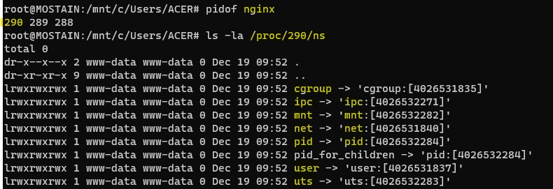
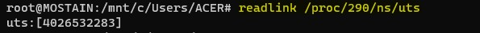

# Linux Namespaces
A Namespace (ns) wraps some global system resource to provide resource isolation.

## Linux support multiple NS types
* Mount | CLONE_NEWNS | 2002
* UTS | CLONE_NEWUTS | 2006
* IPC | CLONE_NEWIPC | 2006
* PID | CLONE_NEWPID | 2008
* Network | CLONE_NEWNET | 2009
* User | CLONE_NEWUSER | 2013
* Cgroup | CLONE_NEWCGROUP | 2016
* Time (proposed)

## Namespaces are Linux-specific feature
* For each NS type
    * Multiple instances of NS may exist on a system
        * At system boot, there is one instance of each NS type (initial namespace)
    * Each process resides in one NS instance.
    * To process inside NS instance, it appears that only they can see/modify corresponding global resource.
        * Processes are unaware of other instances of resource.

* When new processes is created via fork(), it resides in same set of NSs as parent.

> One of the most interesting types of namespaces is `user namespaces` and that's what I'm gonna sort of drill down to it in the second piece because user namespaces sort of bring all the other namespaces together in a way that let us do some quite powerful things things like nprivileged containers for example.

In a container-style frameworks, most or All  NS types are used in concert.
### How its possible to be:
* super user inside
* Unprivileged outside

### Unprivileged containers

## UTS Namespace
* Simplest namespace, Isolate two system identifiers returned by uname(2) `man 2 uname`
    * `nodename` - system hostname (set by sethostname)
    * `domainname` - NIS domain name / Yellow pages domain
* Container configuration scripts might tailor their actions based on these IDs.
    * `nodename` could be used with DHCP to obtain IP address for container.
* Running system may have multiple UTS NS instances.
* Process within single instance(UTS NS instance) access (get/set) same nodename and domainname.
* Each NS instance has its own nodename and domainname
    * Changes to nodename and domainname in one NS instance are invisible  to others instances.

### NIS domain name
An NIS domain is a collection of systems that are logically grouped together. A group of hosts that share the same set of NIS maps belong to the same domain. The hosts are usually grouped together in the domain for a common reason; for example, when working in the same group at a particular location. NIS focuses on making network administration more manageable by providing centralized control over a variety of network information.

### uname(2) `man 2 uname`
* uname - get name and information about current kernel
* Part of the utsname information is also accessible via `/proc/sys/kernel/{ostype, hostname, osrelease, version, domainname}`.

## Namespaces API & Commands

## ls -la /proc/PID/ns
Each process has some symlink files in `/proc/PID/ns`

One symlink for each of the NS types

> tells us which namespace does this process belongs to

### Target of symblink tells us which NS instance process is in.
> `readlink /proc/290/ns/uts`

> Format of the above output: `ns_type : [magic_inode_number]` = uts:[4026532283]
 * magic_inode_number =  unique inode number correponding to this namespace.

### Various uses for the  /proc/PID/ns symlinks
 * If processes show same  symlink target, they are in the same NS.

### APIs and commands
Programs can use various system calls to work with NS/namespaces.
* clone: create new child process in the new NS(s).
* unshare: create  new NS(s) and move caller into it.
* setns: move calling process another existing NS(s) instance.

### The unshare and nsenter have flags for specifying each NS type.

> `unshare [options] [command/program [args]]`

* -C = Create new Cgroup NS
* -i = Create new IPC NS 
* -m = Create new Mount NS
* -n = Create new Network NS
* -p = Create new PID NS
* -u = Create new UTS NS
* -U = Create new user NS

#### nsenter

> `nsenter [options] [command/program [args]]`

* -t PID = PID of process which NSs should be entered
* -C = Enter cgroup NS of target process
* -i = Enter IPC NS of target process
* -m = Enter Mount NS of target process
* -n = Enter network NS of target process
* -p = Enter PID NS of target process
* -u = Enter UTS NS of target process
* -U = Enter user NS of target process
* -a = Enter all NSs of target process

### Previlege requirements for creating namespaces
* Creating user NS instances require no privileges.
* Creating instances of other (nonuser) NS types requires privilege.
    * CAP_SYS_ADMIN

 ### persistent namespace

## Learning Resource
* https://lwn.net/Articles/531114/