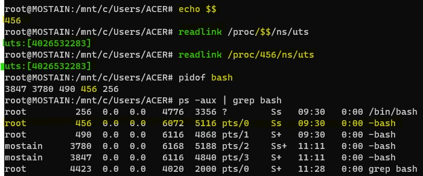
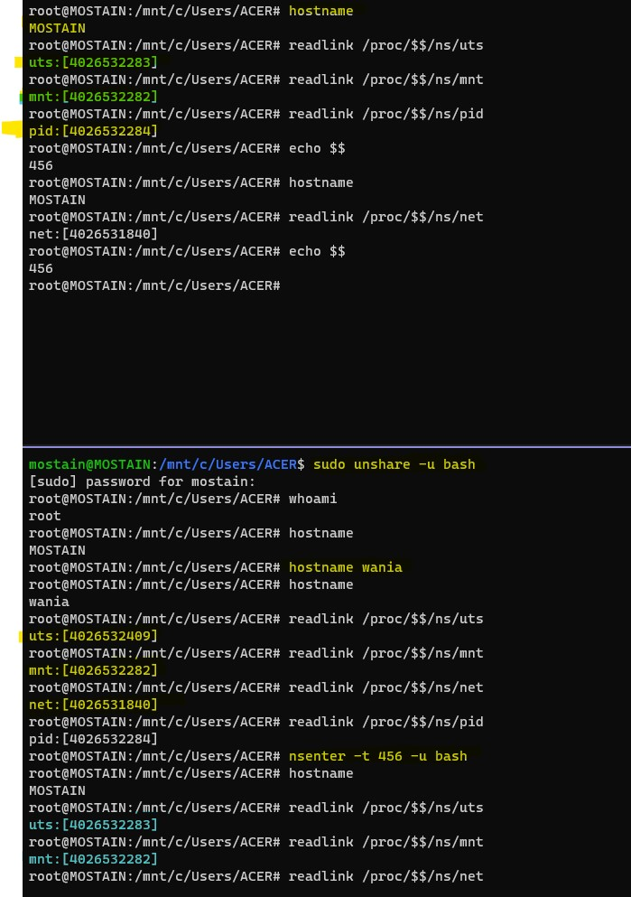

# Linux Namespaces
A Namespace (ns) wraps some global system resource to provide resource isolation.

## Linux support multiple NS types
* Mount | CLONE_NEWNS | 2002
* UTS | CLONE_NEWUTS | 2006
* IPC | CLONE_NEWIPC | 2006
* PID | CLONE_NEWPID | 2008
* Network | CLONE_NEWNET | 2009
* User | CLONE_NEWUSER | 2013
* Cgroup | CLONE_NEWCGROUP | 2016
* Time (proposed)

## Namespaces are Linux-specific feature
* For each NS type
    * Multiple instances of NS may exist on a system
        * At system boot, there is one instance of each NS type (initial namespace)
    * Each process resides in one NS instance.
    * To process inside NS instance, it appears that only they can see/modify corresponding global resource.
        * Processes are unaware of other instances of resource.

* When new processes is created via fork(), it resides in same set of NSs as parent.

> One of the most interesting types of namespaces is `user namespaces` and that's what I'm gonna sort of drill down to it in the second piece because user namespaces sort of bring all the other namespaces together in a way that let us do some quite powerful things things like nprivileged containers for example.

In a container-style frameworks, most or All  NS types are used in concert.
### How its possible to be:
* super user inside
* Unprivileged outside

### Unprivileged containers


## UTS Namespace
* Simplest namespace, Isolate two system identifiers returned by uname(2) `man 2 uname`
    * `nodename` - system hostname (set by sethostname)
    * `domainname` - NIS domain name / Yellow pages domain
* Container configuration scripts might tailor their actions based on these IDs.
    * `nodename` could be used with DHCP to obtain IP address for container.
* Running system may have multiple UTS NS instances.
* Process within single instance(UTS NS instance) access (get/set) same nodename and domainname.
* Each NS instance has its own nodename and domainname
    * Changes to nodename and domainname in one NS instance are invisible  to others instances.

### NIS domain name
An NIS domain is a collection of systems that are logically grouped together. A group of hosts that share the same set of NIS maps belong to the same domain. The hosts are usually grouped together in the domain for a common reason; for example, when working in the same group at a particular location. NIS focuses on making network administration more manageable by providing centralized control over a variety of network information.

### uname(2) `man 2 uname`
* uname - get name and information about current kernel
* Part of the utsname information is also accessible via `/proc/sys/kernel/{ostype, hostname, osrelease, version, domainname}`.


## Namespaces API & Commands

## ls -la /proc/PID/ns
Each process has some symlink files in `/proc/PID/ns`

One symlink for each of the NS types

> tells us which namespace does this process belongs to

### Target of symblink tells us which NS instance process is in.
> `readlink /proc/290/ns/uts`


> Format of the above output: `ns_type : [magic_inode_number]` = uts:[4026532283]
 * magic_inode_number =  unique inode number correponding to this namespace.

### Various uses for the  /proc/PID/ns symlinks
 * If processes show same  symlink target, they are in the same NS.

### APIs and commands
Programs can use various system calls to work with NS/namespaces.
* clone: create new child process in the new NS(s).
* unshare: create  new NS(s) and move caller into it.
* setns: move calling process another existing NS(s) instance.

### The unshare and nsenter have flags for specifying each NS type.

> `unshare [options] [command/program [args]]`

* -C = Create new Cgroup NS
* -i = Create new IPC NS 
* -m = Create new Mount NS
* -n = Create new Network NS
* -p = Create new PID NS
* -u = Create new UTS NS
* -U = Create new user NS

#### nsenter

> `nsenter [options] [command/program [args]]`

* -t PID = PID of process which NSs should be entered
* -C = Enter cgroup NS of target process
* -i = Enter IPC NS of target process
* -m = Enter Mount NS of target process
* -n = Enter network NS of target process
* -p = Enter PID NS of target process
* -u = Enter UTS NS of target process
* -U = Enter user NS of target process
* -a = Enter all NSs of target process


### Previlege requirements for creating namespaces
* Creating user NS instances require no privileges.
* Creating instances of other (nonuser) NS types requires privilege.
    * CAP_SYS_ADMIN


* echo $$ - shows the PID of the shell
* readlink /proc/$$/ns/uts


> `readlink /proc/$$/ns/mnt`\
> `readlink /proc/$$/ns/uts`\
> `readlink /proc/$$/ns/pid`


> unshare -u bash

> sudo unshare -u bash

> hostname wania

> readlink /proc/$$/ns/uts

> readlink /proc/$$/ns/mnt

> readlink /proc/$$/ns/net

> nsenter -t 456 -u bash


### Persistent namespace
* https://breachlabs.io/unshare-linux-persistence-technique

> `unshare -pf --mount-proc /bin/bash`

Running unshare -m gives the calling process a private copy of its mount namespace, and also unshares file system attributes so that it no longer shares its root directory, current directory, or umask attributes with any other process.

### persistent UTS namespace
creates a new persistent UTS namespace and modifies the hostname
```
# touch /root/uts-ns
# unshare --uts=/root/uts-ns hostname wania
# nsenter --uts=/root/uts-ns hostname
wania
# umount /root/uts-ns
```

### persistent mount namespace
```
# mkdir /root/namespaces
# mount --bind /root/namespaces /root/namespaces
# mount --make-private /root/namespaces
# touch /root/namespaces/mnt
# unshare --mount=/root/namespaces/mnt
```

### Private mount points with unshare

> unshare --map-root-user bash

> unshare --uts bash

> /sbin/init

> echo `$!` PID of last job running in background.

> unshare --user &\
> mount --bind /proc/$!/ns/user /root/user-ns\
> kill -9 $!

### PID | Process Namespace
Every time a computer with Linux boots up, it starts with just one process, with process identifier (PID) 1. This process is the root of the process tree, and it initiates the rest of the system by performing the appropriate maintenance work and starting the correct daemons/services. All the other processes start below this process in the tree. The PID namespace allows one to spin off a new tree, with its own PID 1 process. The process that does this remains in the parent namespace, in the original tree, but makes the child the root of its own process tree.

With PID namespace isolation, processes in the child namespace have no way of knowing of the parent process’s existence. However, processes in the parent namespace have a complete view of processes in the child namespace, as if they were any other process in the parent namespace.


> findmnt -o+PROPAGATION

## FSTYPE: File System Type:
* rootfs
* overlay
* tmpfs
* cgroup
* proc
* ext4 - Extended File System
* 9p

## Host machine All NS
> readlink /proc/1/ns/uts

```bash
root@mhost:~# readlink /proc/1/ns/*
cgroup:[4026531835]
ipc:[4026532271]
mnt:[4026532282]
net:[4026531840]
pid:[4026532284]
pid:[4026532284]
user:[4026531837]
uts:[4026532283]
```

## Learning Resource
* https://lwn.net/Articles/531114/
* https://www.youtube.com/watch?v=YmbCfeVPHEI
* [Unsharing the user namespace for rootless containers](https://www.youtube.com/watch?v=YmbCfeVPHEI)
* https://superuser.com/questions/1729906/how-to-quit-from-linux-namespace
* [Linux File System Explained](https://www.youtube.com/watch?v=ePN5igV9ZpY)
* https://unix.stackexchange.com/questions/710809/why-is-the-linux-command-unshare-pid-p-mount-m-not-creating-a-persistent-n
* [Let's code a Linux Driver - 0: Introduction](https://www.youtube.com/watch?v=x1Y203vH-Dc&list=PLCGpd0Do5-I3b5TtyqeF1UdyD4C-S-dMa)
* https://www.toptal.com/linux/separation-anxiety-isolating-your-system-with-linux-namespaces
* [Write your own Operating System](https://www.youtube.com/watch?v=soQCkeBDOAY&list=PLHh55M_Kq4OAIL0fNVfvBt2VuX2cJeXjk)
* [Let's code a Linux Driver - 0: Introduction](https://www.youtube.com/watch?v=x1Y203vH-Dc&list=PLCGpd0Do5-I3b5TtyqeF1UdyD4C-S-dMa)